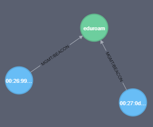
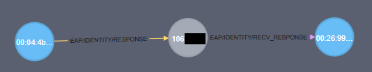
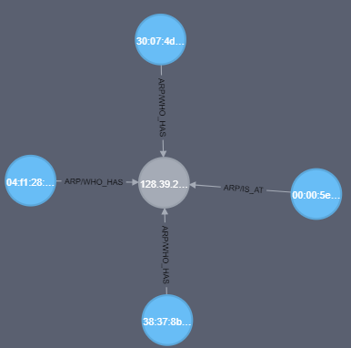

# ViFi - VIsualizer for wiFI
 [](LICENSE.md)

Do you have a PCAP full of WiFi data and want to make sense of it? This is the tool for you.
Originally developed under contract for [University of Southeast Norway](https://usn.no), ViFi visualizes metadata from nearby WiFi-networks and devices. ViFi takes packets from a PCAP, an interface or **all** interfaces and extracts information from them to find relationships.

## Install
### Dependencies

- Python 3.6 or higher, might with earlier versions (python3)
- Python pip for (python3-pip)
- neo4j (Tested using neo4j:latest docker image)
- Python packages listed in requirements.txt (pip3 install -r requirements.txt)

## Usage

```bash
python3 vifi.py test.cap # Load data from one PCAP
python3 vifi.py *.cap # Load data from all PCAPs in folder
python3 wlan0 # Load data from wlan0 (must be in monitor mode and on the correct channel)
```

## Useful queries

## Find all networks
```
MATCH (n:network)
RETURN n
```

## Find all probe requests, which devices made them and what networks have have been requested

```neo4j
MATCH p=()-[:`WIFI/MGMT/PROBE_REQUEST`]->()
RETURN p
```

## Find all beacons, which devices made them and what networks they beaconed for

```neo4j
MATCH p=()-[:`WIFI/MGMT/BEACON`]->()
RETURN p
```

## Find all all EAP identities and all the devices related to them

```neo4j
MATCH p=(:identity)--()
RETURN p
```
**Note**: This is likely to reveal email-addresses


## Find all ARP data

```neo4j
MATCH p=()-[:`ARP/IS_AT`]-()-[:`ARP/WHO_HAS`]-()
RETURN p
```
